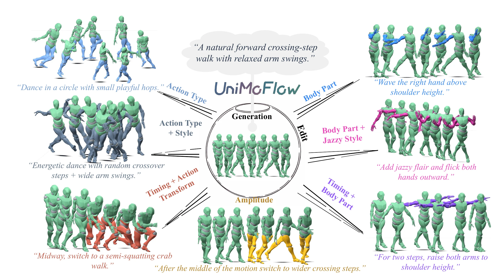

# UniMoFlow

[](https://arxiv.org/abs/2608.09143)
[](https://unimoflow-motion.shayla-fralix845.chatgpt.site)

Official code release for **UniMoFlow: Grounding Instruction-Driven 3D Human Motion Editing in Generation**.

UniMoFlow studies 3D human motion generation and instruction-driven motion editing in a unified latent flow-matching framework. The model treats text-to-motion generation and source-conditioned editing as mutually supportive abilities: it learns from high-quality text-to-motion data and synthetic instruction-edit triplets, then switches between generation and editing through a shared context token sequence and task-aware attention masks. The repository also includes the **Omni-MoEdit** data synthesis pipeline used to construct instruction-driven edit supervision.

> Paper: [arXiv:2608.09143](https://arxiv.org/abs/2608.09143). Project page: [UniMoFlow](https://unimoflow-motion.shayla-fralix845.chatgpt.site).

<p align="center">
  
</p>

## Links

- Paper: [arXiv](https://arxiv.org/abs/2608.09143) | [PDF](https://arxiv.org/pdf/2608.09143)
- Project page: [UniMoFlow](https://unimoflow-motion.shayla-fralix845.chatgpt.site)
- Checkpoints: **coming soon**
- Omni-MoEdit synthetic data: **coming soon**

## What Is Included

```text
UniMoFlow/
  codes/
    train_unimoflow.py          # joint generation/edit training
    run_unimoflow.py            # generation and editing inference
    evaluate_unimoflow.py       # evaluation entry point
    models_flow/                # UniMoFlow and latent VAE modules
    trainers/                   # mixed generation/edit training loop
    dataset/                    # text-motion and edit-pair datasets
    model/evaluator/            # evaluation encoders
    omni_moedit/                # Omni-MoEdit synthesis and filtering pipeline
    utils/
  configs/                      # portable configuration templates
  examples/                     # minimal JSON input examples
  assets/teaser.webp            # teaser reused from the paper/project assets
  CONFIGURATION.md
  PRETRAINED_MODELS.md
  THIRD_PARTY_NOTICES.md
  TODO.md
  requirements.txt
```

This repository intentionally excludes model weights, training checkpoints, datasets, logs, and generated visualizations. See `PRETRAINED_MODELS.md` and `TODO.md` for the planned release items.

## Installation

```bash
conda create -n unimoflow python=3.10 -y
conda activate unimoflow
pip install -r requirements.txt
```

The code expects PyTorch, CUDA-enabled dependencies, text encoder assets, evaluator checkpoints, and motion data. Exact paths can be edited in `configs/*.yaml`.

## Prepare Assets

Create the expected folders:

```bash
mkdir -p pretrained/unimoflow pretrained/hrvae_detail pretrained/umt5-xxl pretrained/evaluator data outputs
```

Then place external assets according to `PRETRAINED_MODELS.md`. The current public repository leaves placeholders for:

- UniMoFlow checkpoint.
- HRVAE / causal VAE checkpoint.
- evaluator checkpoint.
- uMT5 text encoder assets.
- Omni-MoEdit synthetic edit data.
- pretrained motion DiT used by the data synthesis pipeline.

## Inference

Generate a motion from text:

```bash
cd codes
python run_unimoflow.py \
  --config ../configs/unimoflow.yaml \
  --which_epoch ../pretrained/unimoflow/net_best_fid.tar \
  --mode t2m \
  --text "A person walks forward with a crossing-step gait." \
  --output_dir ../outputs/t2m
```

Edit a source latent with the native editing mode or SAFE:

```bash
cd codes
python run_unimoflow.py \
  --config ../configs/unimoflow.yaml \
  --which_epoch ../pretrained/unimoflow/net_best_fid.tar \
  --mode edit \
  --motion_file ../data/source_latent.npy \
  --is_latent true \
  --edit_text "Raise the right hand while continuing to walk forward." \
  --self_flowedit true \
  --output_dir ../outputs/edit
```

Use `python codes/run_unimoflow.py --help` for available generation, editing, sampling, and output options.

## Training UniMoFlow

Single GPU:

```bash
cd codes
python train_unimoflow.py --config ../configs/unimoflow.yaml
```

Distributed training:

```bash
cd codes
torchrun --nproc_per_node=2 train_unimoflow.py --config ../configs/unimoflow.yaml
```

The default mixed-training configuration uses one generation batch and one editing batch at each optimizer step. Generation and editing losses are computed jointly and combined according to the weights in `configs/unimoflow.yaml`.

## Evaluation

```bash
cd codes
python evaluate_unimoflow.py \
  --config ../configs/unimoflow.yaml \
  --which_epoch ../pretrained/unimoflow/net_best_fid.tar \
  --output_dir ../outputs/evaluation
```

The evaluator reports text-to-motion metrics and editing metrics used in the paper. Dataset paths and evaluator checkpoints are configured in `configs/unimoflow.yaml`.

## Omni-MoEdit Data Synthesis

The `codes/omni_moedit` folder contains the pipeline for constructing Omni-MoEdit:

1. Generate edit commands, target captions, and auxiliary metadata from source captions using a pretrained LLM.
2. Encode source motions into latent tokens with the causal VAE.
3. Synthesize target motions with a pretrained text-to-motion DiT using FlowEdit-style sampling.
4. Filter candidates by target-text alignment, edit improvement over the source, and motion-structure constraints.
5. Optionally regenerate weak records and run second-stage filtering.

Example:

```bash
cd codes

python omni_moedit/generate_multi_attribute_edits.py \
  --input ../data/SnapMoGen/all_caption_clean.json \
  --output_dir ../outputs/omni_moedit/text_pairs \
  --model ../pretrained/Qwen3-8B \
  --gpus 0,1 \
  --types coarse,fine,style

python omni_moedit/synthesize_and_filter.py \
  --config ../configs/omni_moedit_filter.yaml \
  --input_json ../outputs/omni_moedit/text_pairs/all_edit_pairs.json \
  --output_dir ../outputs/omni_moedit/synthesized_pairs
```

The exact JSON filenames emitted by the LLM stage depend on `--types`; pass the desired generated JSON to `--input_json`.

## Citation

If you find this work useful, please cite:

```bibtex
@article{hua2026unimoflow,
  title   = {UniMoFlow: Grounding Instruction-Driven 3D Human Motion Editing in Generation},
  author  = {Hua, Yilei and Jing, Beibei and Zheng, Ce and Zhou, Hanyu and Luo, Yawei and Yang, Wei},
  journal = {arXiv preprint arXiv:2608.09143},
  year    = {2026},
  url     = {https://arxiv.org/abs/2608.09143}
}
```

## License

The final open-source license is to be added before the public release. Please do not redistribute checkpoints or datasets until their release terms are finalized.

## Acknowledgements

This codebase builds on common components from text-to-motion generation, latent flow matching, and motion evaluation pipelines. See `THIRD_PARTY_NOTICES.md` for third-party notes.
